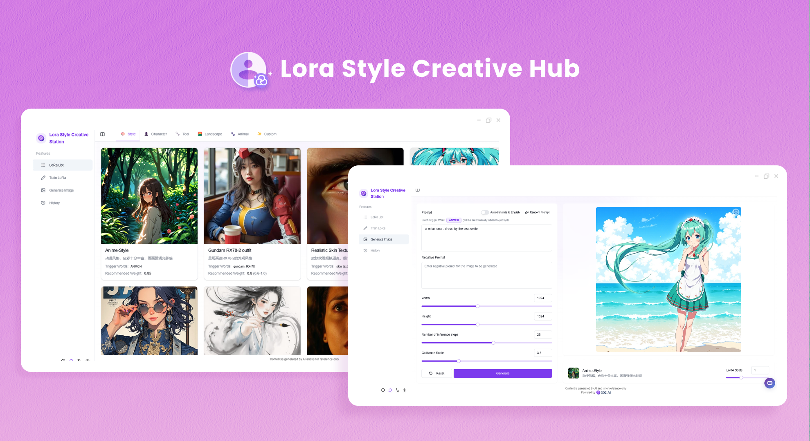
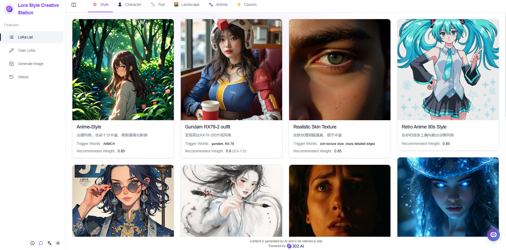
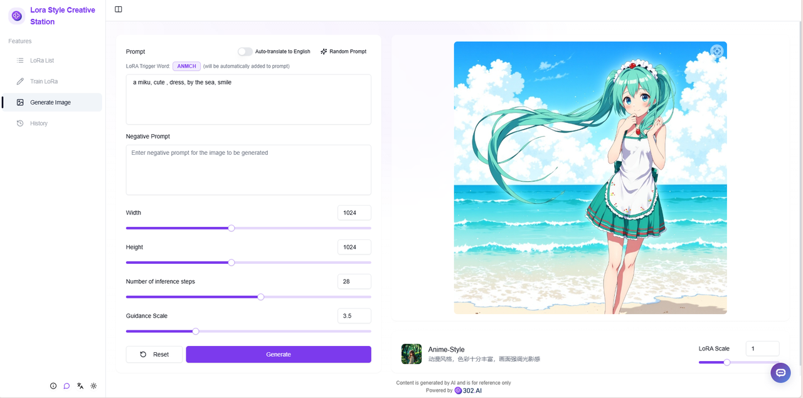
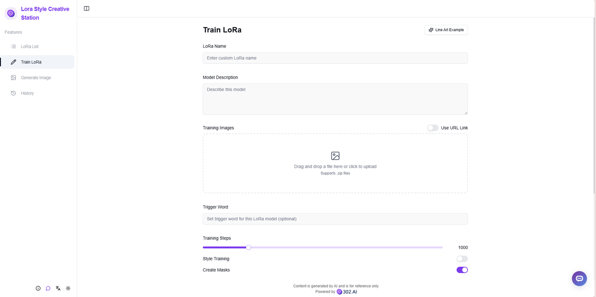
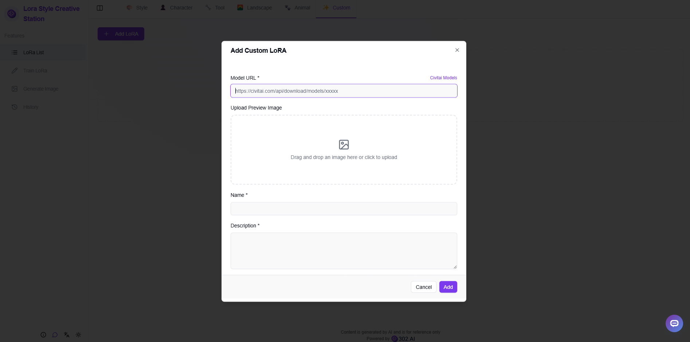
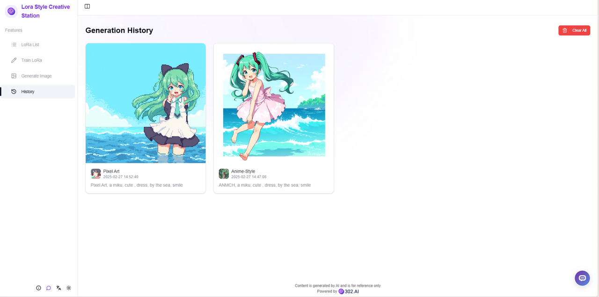

# 
 🖼️ Lora Style Creative Hub 🚀✨

Lora Style Creative Hub allows you to train your own or directly use various provided Lora style models, input image descriptions, and generate images in corresponding styles using Lora models.

<a href="README_zh.md">中文</a> | <a href="README.md">English</a> | <a href="README_ja.md">日本語</a>

This is the open-source version of the [Lora Style Creative Hub](https://302.ai/product/detail/61) from [302.AI](https://302.ai/en/). You can directly log in to 302.AI to use the online version with zero code and zero background, or modify and deploy it yourself according to your requirements.

## Interface Preview
The homepage offers multiple Lora style models for use.

You can select different Lora style models, input prompts, and set parameters to generate images.

Supports users to package and upload training sets for custom Lora training.

You can upload your own specified Lora models.

All generated image works can be viewed in the history records.

## Project Features
### 🎨 Diverse Lora Models
Provides rich pre-trained Lora models, supporting various artistic styles and creation types.
### 🔧 Custom Training
Supports users to upload their own training sets to customize exclusive Lora models.
### 📤 Model Import
Allows importing custom Lora models for use.
### 🎯 Parameter Tuning
Provides rich parameter setting options for precise control of generation effects.
### 💾 History Records
Complete preservation of all generation records.
### 🌍 Multi-language Support
- Chinese Interface
- English Interface
- Japanese Interface

## 🚩 Future Update Plans
- [ ] Support for more Lora style models

## 🛠️ Tech Stack
- React
- Tailwind CSS
- Shadcn UI

## Development & Deployment
1. Clone project `git clone https://github.com/302ai/302_lora`
2. Install dependencies `npm`
3. Configure 302's API KEY (refer to .env.example)
4. Run project `npm run dev`
5. Build and deploy `docker build -t 302_lora . && docker run -p 3000:80 302_lora`
6. Node version 20 or above required

## ✨ About 302.AI ✨
[302.AI](https://302.ai/en/) is an enterprise-oriented AI application platform that offers pay-as-you-go services, ready-to-use solutions, and an open-source ecosystem.✨
1. 🧠 Comprehensive AI capabilities: Incorporates the latest in language, image, audio, and video models from leading AI brands.
2. 🚀 Advanced application development: We build genuine AI products, not just simple chatbots.
3. 💰 No monthly fees: All features are pay-per-use, fully accessible, ensuring low entry barriers with high potential.
4. 🛠 Powerful admin dashboard: Designed for teams and SMEs - managed by one, used by many.
5. 🔗 API access for all AI features: All tools are open-source and customizable (in progress).
6. 💡 Powerful development team: Launching 2-3 new applications weekly with daily product updates. Interested developers are welcome to contact us.
