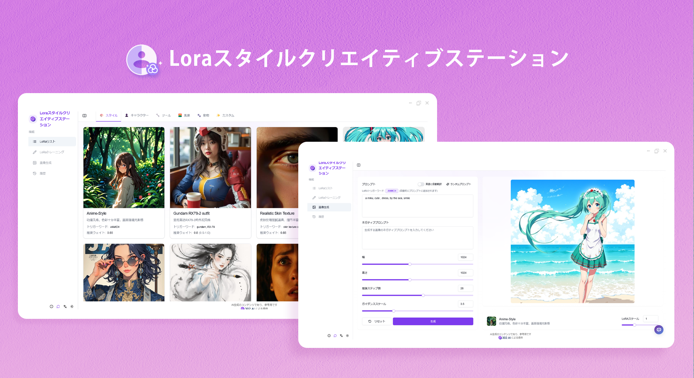
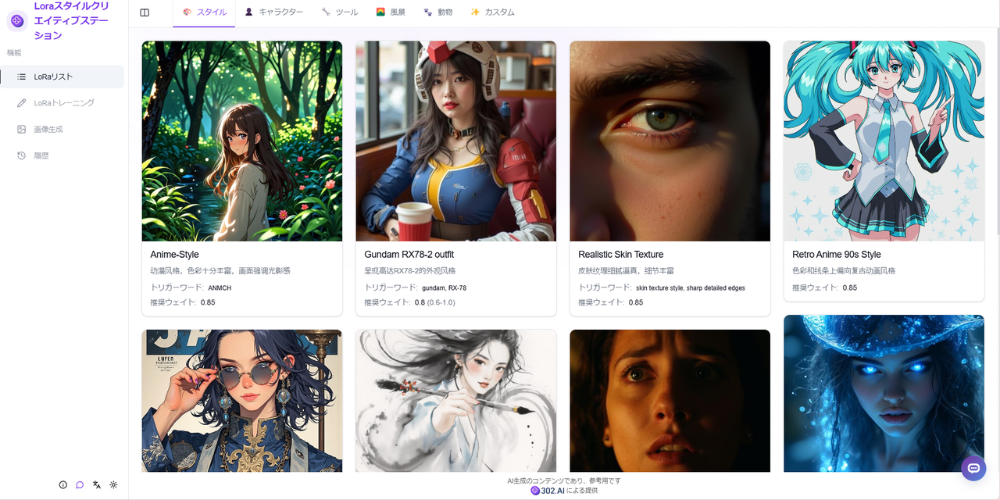
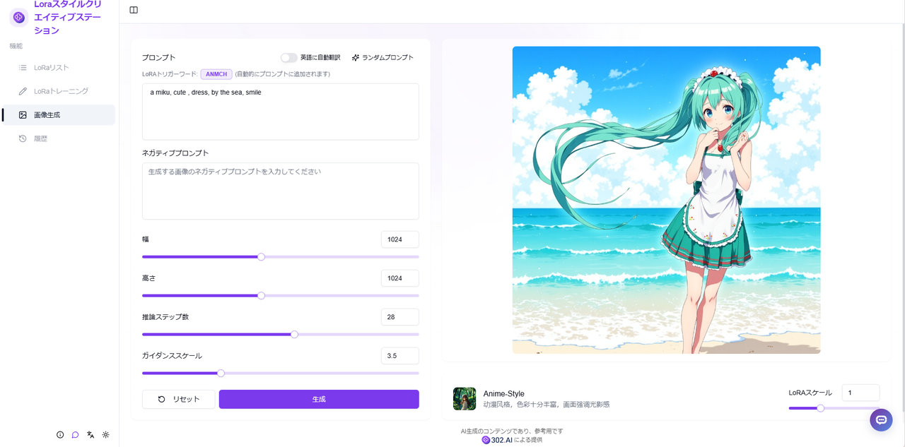
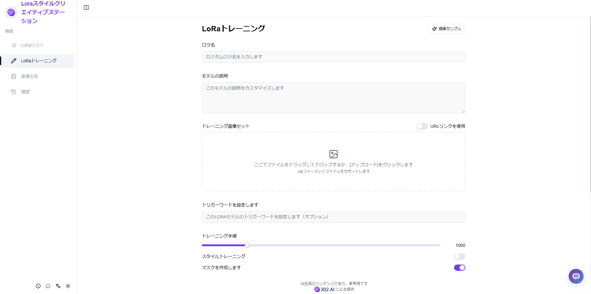
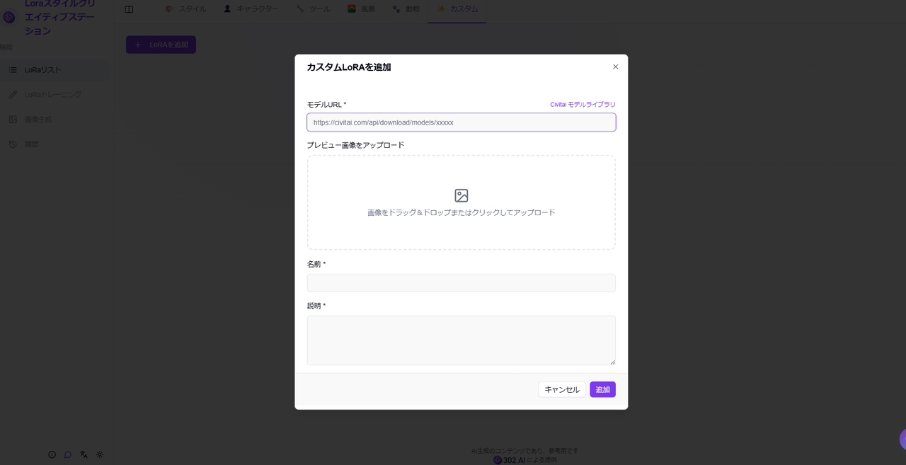
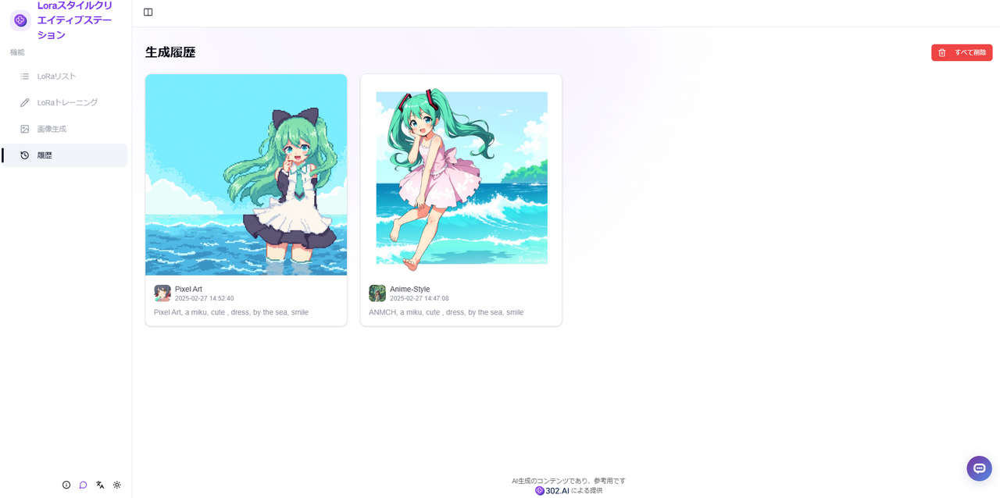

# 
 🖼️ Loraスタイルクリエイティブステーション 🚀✨

Loraスタイルクリエイティブステーションでは、独自のトレーニングや提供済みの様々なスタイルのLoraモデルを直接使用でき、画像の説明を入力することで、Loraモデルを使用して対応するスタイルの画像を生成できます。

<a href="README_zh.md">中文</a> | <a href="README.md">English</a> | <a href="README_ja.md">日本語</a>

[302.AI](https://302.ai/ja/)の[Loraスタイルクリエイティブステーション](https://302.ai/product/detail/61)のオープンソース版です。
302.AIに直接ログインすることで、コード不要、設定不要のオンライン体験が可能です。
あるいは、このプロジェクトをニーズに合わせてカスタマイズし、302.AIのAPI KEYを統合して、自身でデプロイすることもできます。

## インターフェースプレビュー
ホームページには様々なスタイルのLoraモデルが利用可能です。

異なるスタイルのLoraモデルを選択し、プロンプトを入力してパラメータを設定して画像を生成できます。

ユーザーはトレーニングセットをパッケージ化してアップロードし、カスタムLoraトレーニングを行うことができます。

指定したLoraモデルを自分でアップロードすることができます。

履歴で生成されたすべての画像作品を確認できます。

## プロジェクトの特徴
### 🎨 多様なLoraモデル
豊富な事前学習済みLoraモデルを提供し、様々なアートスタイルと創作タイプをサポートします。
### 🔧 カスタムトレーニング
ユーザーが独自のトレーニングセットをアップロードし、専用のLoraモデルをカスタマイズできます。
### 📤 モデルのインポート
カスタムLoraモデルのインポートと使用が可能です。
### 🎯 パラメータ調整
豊富なパラメータ設定オプションを提供し、生成効果を正確にコントロールできます。
### 💾 履歴記録
すべての生成記録を完全に保存します。
### 🌍 多言語サポート
- 中国語インターフェース
- 英語インターフェース
- 日本語インターフェース

## 🚩 将来のアップデート計画
- [ ] より多くのスタイルのLoraモデルをサポート

## 🛠️ 技術スタック
- React
- Tailwind CSS
- Shadcn UI

## 開発とデプロイ
1. プロジェクトのクローン `git clone https://github.com/302ai/302_lora`
2. 依存関係のインストール `npm`
3. 302のAPI KEYを設定 (.env.exampleを参照)
4. プロジェクトの実行 `npm run dev`
5. ビルドとデプロイ `docker build -t 302_lora . && docker run -p 3000:80 302_lora`
6. Node バージョン20以上が必要

## ✨ 302.AIについて ✨
[302.AI](https://302.ai/ja/)は企業向けのAIアプリケーションプラットフォームであり、必要に応じて支払い、すぐに使用できるオープンソースのエコシステムです。✨
1. 🧠 包括的なAI機能：主要AIブランドの最新の言語、画像、音声、ビデオモデルを統合。
2. 🚀 高度なアプリケーション開発：単なるシンプルなチャットボットではなく、本格的なAI製品を構築。
3. 💰 月額料金なし：すべての機能が従量制で、完全にアクセス可能。低い参入障壁と高い可能性を確保。
4. 🛠 強力な管理ダッシュボード：チームやSME向けに設計 - 一人で管理し、多くの人が使用可能。
5. 🔗 すべてのAI機能へのAPIアクセス：すべてのツールはオープンソースでカスタマイズ可能（進行中）。
6. 💪 強力な開発チーム：大規模で高度なスキルを持つ開発者集団。毎週2-3の新しいアプリケーションをリリースし、毎日製品更新を行っています。才能ある開発者の参加を歓迎します。
