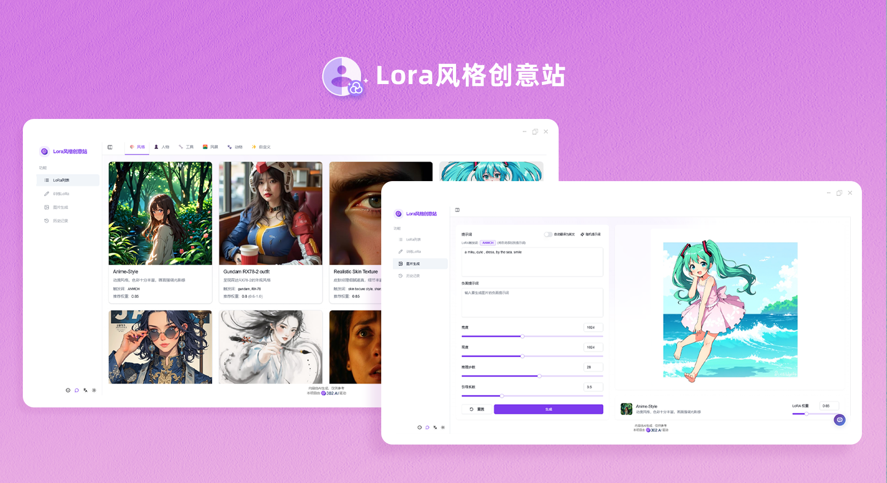
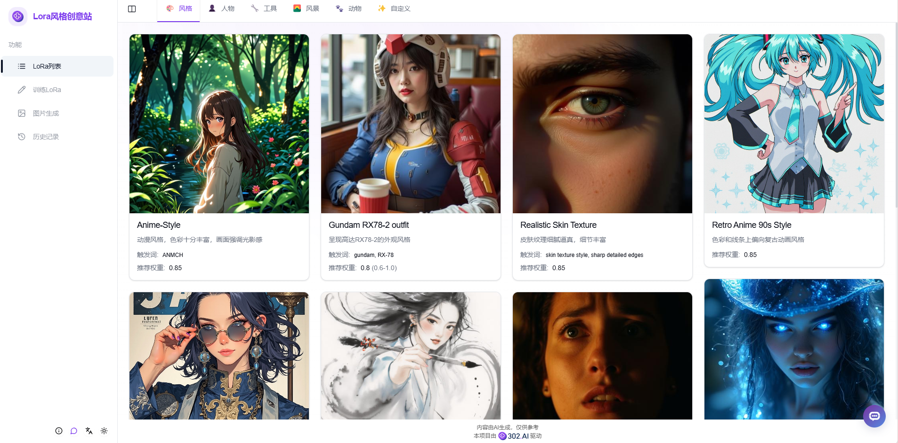
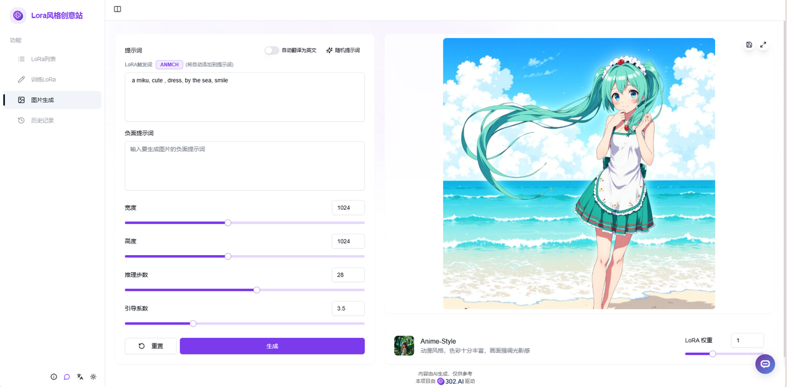
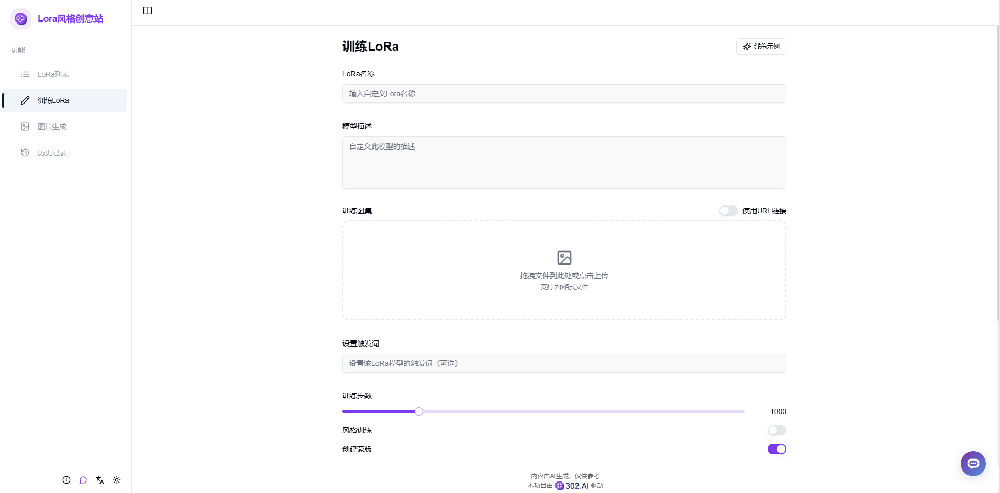
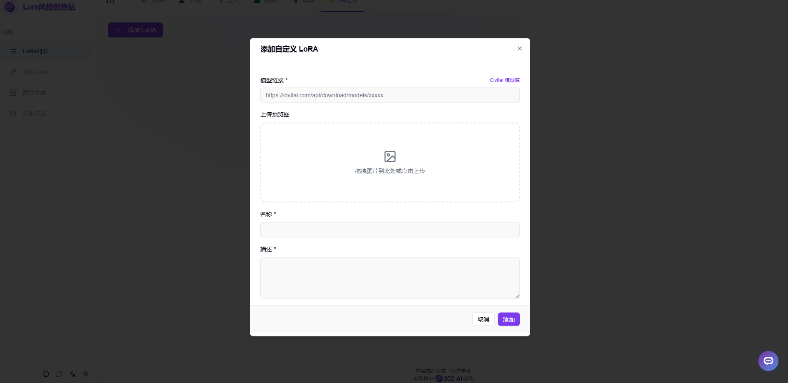
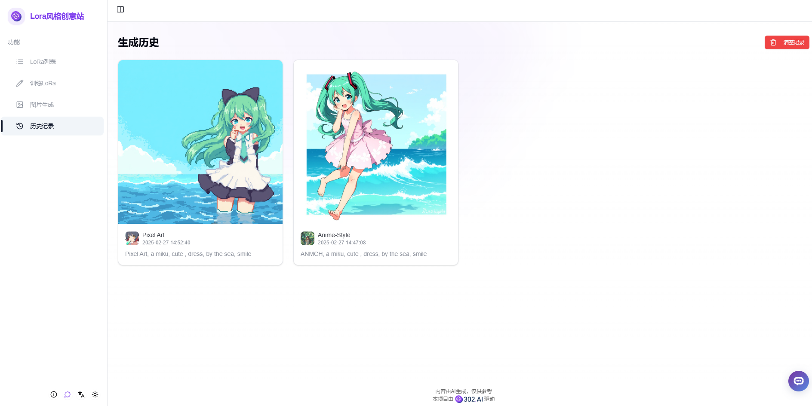

# 
 🖼️ Lora风格创意站 🚀✨

Lora风格创意站可以自行训练或直接使用已提供的多种风格Lora模型，输入对于图片的描述，使用Lora模型生成对应风格的图片。

<a href="README_zh.md">中文</a> | <a href="README.md">English</a> | <a href="README_ja.md">日本語</a>

来自[302.AI](https://302.ai)的[Lora风格创意站](https://302.ai/product/detail/61)的开源版本。你可以直接登录302.AI，零代码零配置使用在线版本。或者对本项目根据自己的需求进行修改，传入302.AI的API KEY，自行部署。

## 界面预览
首页有多种风格Lora模型提供使用。

可选择不同风格Lora模型，输入提示词设置参数生成图片。

支持用户打包上传训练集，自定义训练Lora。

可以自己上传指定的Lora模型。

在历史记录可以查看所有生成得到的图片作品。

## 项目特性
### 🎨 多样化Lora模型
提供丰富的预训练Lora模型，支持多种艺术风格和创作类型。
### 🔧 自定义训练
支持用户上传自己的训练集，定制专属Lora模型。
### 📤 模型导入
允许导入自定义的Lora模型进行使用。
### 🎯 参数调优
提供丰富的参数设置选项，精确控制生成效果。
### 💾 历史记录
完整保存所有生成记录。
### 🌍 多语言支持
  - 中文界面
  - English Interface
  - 日本語インターフェース

## 🚩 未来更新计划
- [ ] 支持更多风格的Lora模型

## 🛠️ 技术栈
- React
- Tailwind CSS
- Shadcn UI

## 开发&部署
1. 克隆项目 `git clone https://github.com/302ai/302_lora`
2. 安装依赖 `npm`
3. 配置302的API KEY 参考.env.example
4. 运行项目 `npm run dev`
5. 打包部署 `docker build -t 302_lora . && docker run -p 3000:80 302_lora`
6. node版本为20及以上

## ✨ 302.AI介绍 ✨
[302.AI](https://302.ai)是一个按需付费的AI应用平台，为用户解决AI用于实践的最后一公里问题。
1. 🧠 集合了最新最全的AI能力和品牌，包括但不限于语言模型、图像模型、声音模型、视频模型。
2. 🚀 在基础模型上进行深度应用开发，我们开发真正的AI产品，而不是简单的对话机器人
3. 💰 零月费，所有功能按需付费，全面开放，做到真正的门槛低，上限高。
4. 🛠 功能强大的管理后台，面向团队和中小企业，一人管理，多人使用。
5. 🔗 所有AI能力均提供API接入，所有工具开源可自行定制（进行中）。
6. 💡 强大的开发团队，每周推出2-3个新应用，产品每日更新。有兴趣加入的开发者也欢迎联系我们
